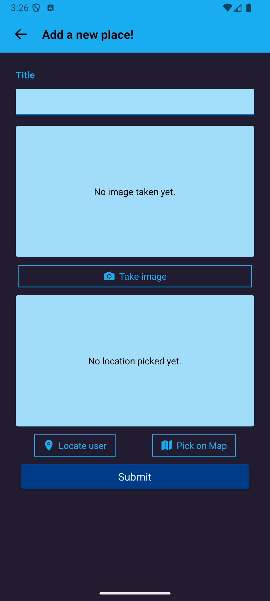
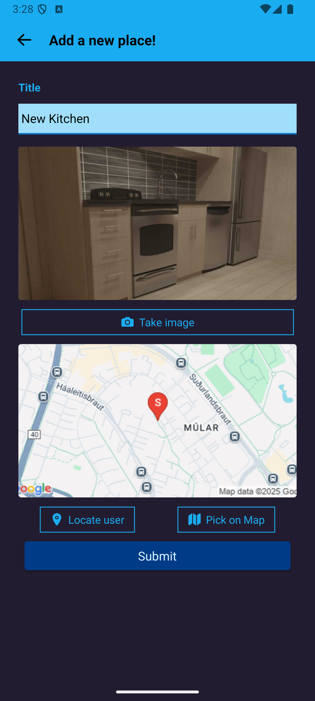
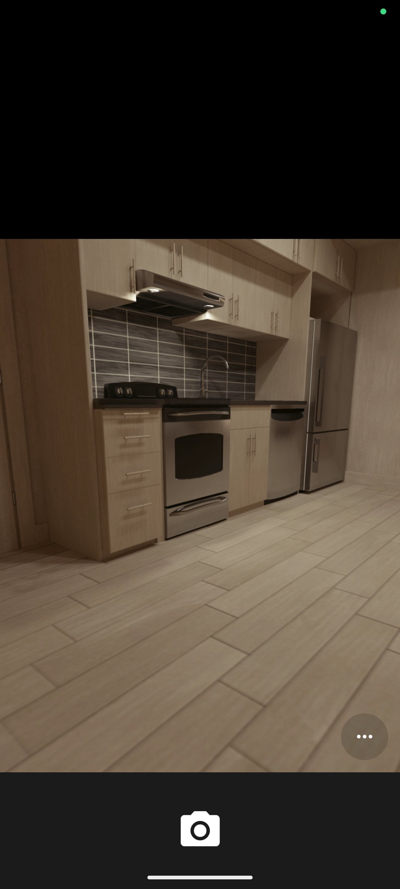
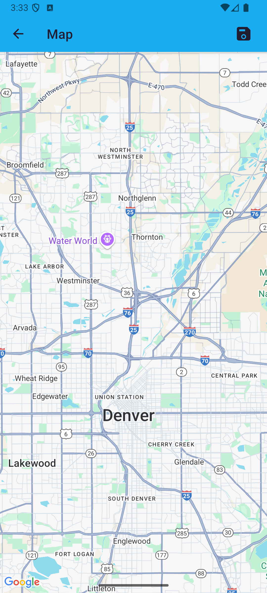

# 📍 React Native Favorite Places

A mobile application built with **React Native**, allowing users to save and view their favorite places on a map. Built using Expo, SQLite, and custom components with React Navigation.

## 🔧 Features

- 📸 Add new places with a title, photo, and geolocation
- 🗺️ View saved places on an interactive map
- 📍 Automatically retrieve current location or pick a location manually
- 🗃️ Persistent storage using SQLite
- 🧭 Navigation between screens using React Navigation
- 🎯 TypeScript support

## 🧰 Tech Stack

- **React Native (Expo)**
- **TypeScript**
- **SQLite (expo-sqlite)**
- **React Navigation**
- **Expo Location & Image Picker**

## 📷 Screenshots

<p align="center">
  
  
  
  
  
  
</p>


## 🚀 Getting Started

1. Clone the repository
```bash
git clone https://github.com/AnOvramenko/RN_Favorite_Places.git
cd RN_Favorite_Places
```

2. Install dependencies
```bash
npm install
```

3. Start the app with Expo
```bash
npx expo start
```

📍 Permissions
This app uses the following permissions:

- Location access (to get current position)
- Media library (to pick images) and camera

Make sure to allow them when prompted.